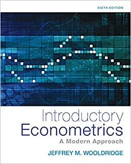
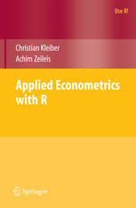

```{r setup, include=FALSE}
knitr::opts_chunk$set(echo = TRUE)
```
```{r klippy, echo=FALSE, include=TRUE}
klippy::klippy(position = c('top', 'right'))
```


Un poil idéaliste, je pense que le rôle de l'économiste est d'améliorer la société.

C'est avec cette idée que je me suis orienté vers l'évaluation des politiques publiques après une formation quantitative à la Paris School of Economics. Stagiaire à la Direction de la Sécurité Sociale, puis à la Direction de la Législation Fiscale, je me suis familiarisé avec les problématiques et le fonctionnement de ces directions. Mon premier poste comme chargé d’étude sur la dépense publique (et notamment locale) à la Direction Générale du Trésor (SPP-FIPU3) s'inscrit dans cette continuité. 


Me reste à ajouter :


- Possibilité d'ajouter le code sous Python ; https://cran.r-project.org/web/packages/reticulate/vignettes/r_markdown.html


- Woolridge : ok. Potentiellement en plus la méthode des variables instrumentales (chap 15)


- completer avec introduction to econometrics with r : https://www.econometrics-with-r.org/ ; chapitre 13 sur les expérimentations et les quasi expérimentations


- Add Lasso and Ridge regression / classification : https://github.com/pmaji/data-science-toolkit/blob/master/classification/logit/logistic_regression.md. Faire un projet complet avec.Il y a également ISL qui fait une très beau sujet là dessus


- Comment choisir un model : https://towardsdatascience.com/which-machine-learning-model-to-use-db5fdf37f3dd


- Pour la catégorie business, jeter un coup d'oeil à TensorHouse : https://github.com/ikatsov/tensor-house

- Costumer Segmentation en Python : https://www.kaggle.com/fabiendaniel/customer-segmentation

- Faire une jolie présentation graphique pour les classifications. Utiliser : https://www.htmlwidgets.org/showcase_rbokeh.html


- regarder https://holtzy.github.io/Pimp-my-rmd/ pour une belle image défilante voir parallax

- Dans dimensionality reduction, continuer LDA et PCA et donner un exemple pour une regresssion ou un KNN

```{ }
<style>
div.blue { background-color:#e6f0ff; border-radius: 5px; padding: 20px;}
</style>
<div class = "blue">

- This is my first conclusion
- This is my second conclusion

</div>
```


You can find here pratical examples found in *Introductory Econometrics: A Modern Approach, 6e by Jeffrey M. Wooldridge* and *Applied Econometrics with R of Kleiber C, Zeileis A (2008)*. 





If not already done, you need to load packages with the following commands before any library. For example, if you need a dataset in the wolldridge package, use the following commandes beforhand. 

```{r, eval=FALSE}
install.packages('wooldridge')
library(wooldridge)
```


There are two main reasons that we may wish to estimate a function : prediction and inference. For each of the algorithms, we detail if it is more suitable in wich approach.

In the case of prediction, the algorithm is often treated as a black box, in the sense that one is not typically concerned with its exact form, provided that it yields accurate predictions for the variable of interest.

In the case of inference, want to understand the relationship between two variables, or more specifically, to understand how the variable of interest changes as a function of others. We can answer the following questions : 
which predictors are associated with the response, what is the relationship between the respond and each predictor, can the relationship between the variable of interest and each predictor be adequately summarized using a linear equation, or is the relationship more complicated ? 

Of the many methods that we examine, some are less flexible,
or more restrictive, in the sense that they can produce just a relatively
small range of shapes to estimate the algorithm. For example, linear regression is a relatively inflexible approach, because it can only generate linear functions.If we are mainly interested in inference, then restrictive models are much more interpretable.


